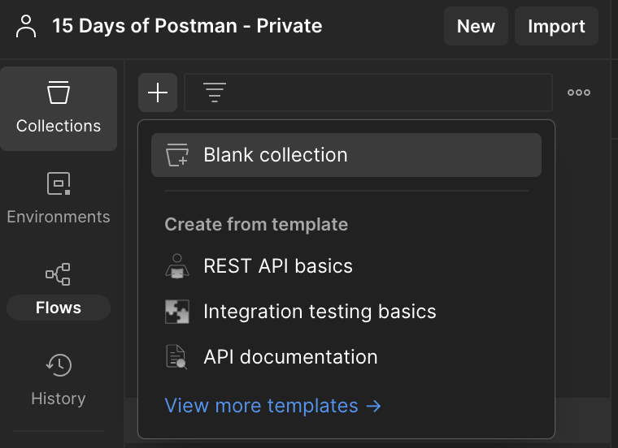

# Day 0: Setup & Orientation

_A gentle start to your Postman tech writing journey._

---

## 🧭 Overview

Before diving into API requests, let’s set up your workspace in Postman. Creating a **collection** will help you stay organized throughout this 15-day challenge. Think of it as a folder where you’ll store all your API experiments, notes, and progress.

This step is simple, visual, and sets the tone for structured learning.

---

## 🎯 What You'll Do

- Create a Postman collection to organize your work
- Name and describe your collection
- Add your first (empty) request to get familiar with the interface

---

## 🛠️ Step-by-Step Guide

### 1. Open Postman

If you haven’t installed it yet, [download Postman here](https://www.postman.com/downloads/).

Once it’s open, you’ll see a sidebar on the left with tabs like **Collections**, **APIs**, and **Environments**.

---

### 2. Create a New Collection

- Click on the **Collections** tab in the left sidebar
- Click the **+ New Collection** button
- Select **Blank Collection** from the menu options

<!--  -->

---

### 3. Name Your Collection

- Name: `Postman Tech Writer Challenge`
- Description: “My 15-day journey into API documentation using Postman.”

This helps you keep your work organized and gives it a personal touch.

<!--  -->

<!--  -->
---

### 4. Add Your First Request

- Click **Add a request**
- Name it: `Day 01 – API Client`
- Leave the request blank for now—we’ll fill it in tomorrow
- Click **Save to collection**

<!--  -->

---

### 5. Explore the Interface (Optional)

Take a moment to click around:
- Notice the tabs: **Params**, **Authorization**, **Headers**, **Body**, **Tests**
- You don’t need to understand them yet—we’ll cover each one in future lessons

---

## 🎉 You Did It

You’ve created your first organized workspace in Postman. This is how professional tech writers manage their API documentation projects—structured, clear, and easy to navigate.

---

## ✍️ Tech Writer’s Lens

Creating a collection isn’t just about organization—it’s about **ownership**. As a tech writer, you’ll often be responsible for documenting APIs across multiple endpoints. Collections help you group related requests, track changes, and collaborate with developers.

---

## 📚 Glossary

- **Collection**: A folder that holds related API requests
- **Request**: An action you send to an API (like asking for data)
- **Endpoint**: A specific URL that returns data from an API

---

## 🔗 Resources

- [Postman Collections Overview](https://learning.postman.com/docs/publishing-your-api/collections/overview/)
- [Postman Interface Tour](https://learning.postman.com/docs/getting-started/navigating-postman/)

---

## ✅ Next Step

Head to [`01-api-client`](../01-api-client/README.md) to send your first real API request!

