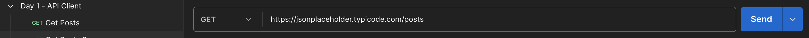
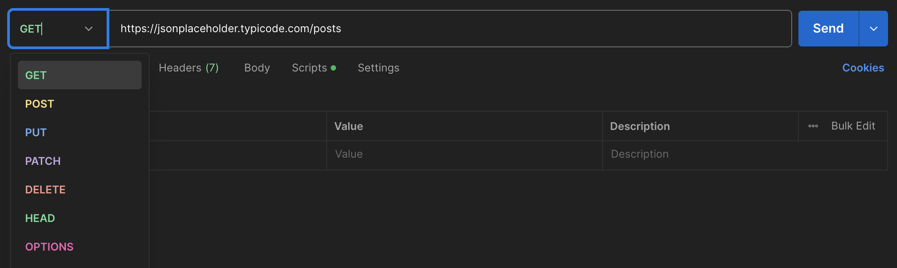

# Day 1: API Client

## 🧭 Overview

Today you'll learn how to use Postman as an API client—your main tool for sending requests, inspecting responses, and understanding how APIs behave. This is the foundation of API documentation work.

## 🎯 What You'll Learn

- What an API client is
- How to send a basic GET request using Postman
- How to read and interpret an API response

## 🛠️ Step-by-Step Guide

### 1. Open Postman and create a new request
<!--  -->

### 2. Set the method to `GET` and enter the URL:

<!--  -->
