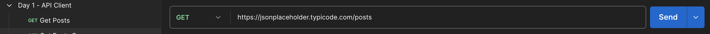
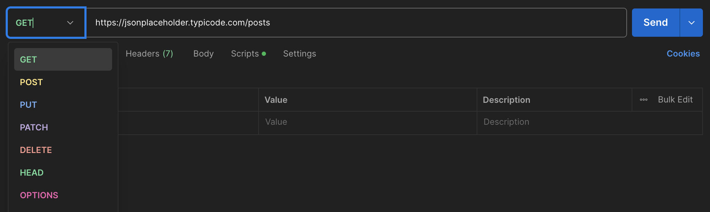

# Day 1: API Client

## 🧭 Overview

Today you'll learn how to use Postman as an API client—your main tool for sending requests, inspecting responses, and understanding how APIs behave. This is the foundation of API documentation work.

## 🎯 What You'll Learn

- What an API client is
- How to send a basic GET request using Postman
- How to read and interpret an API response

## 🛠️ Step-by-Step Guide

### 1. Create a new request
Using the empty request you created in the previous step,type the follwoing URL into the request field.  
https://jsonplaceholder.typicode.com/posts

### 2. Set the method to `GET`:
Click the send button to the right of the URL field. Within a few seconds you will received a response in the lower part of the UI.

## 📬 What Happened & What You Received

**What happened:** Postman asked the server for data using a `GET` request. The server found the information and sent it back.

**What you received:** A **response** containing:
- **Body** – A list of 100 placeholder blog posts (each with a title and body text)
- **Status code** – `200 OK` (means "success, here's your data")
- **Headers** – Technical details about the response (like file type and size)

That's it. The server gave you data; Postman showed it to you.

## ✅ Next Step

Continue your journey by heading to Day 2—[02_version_control](../02_version_control/README.md) —and discover the basics of using version control to keep track of your project changes and collaborate online!
