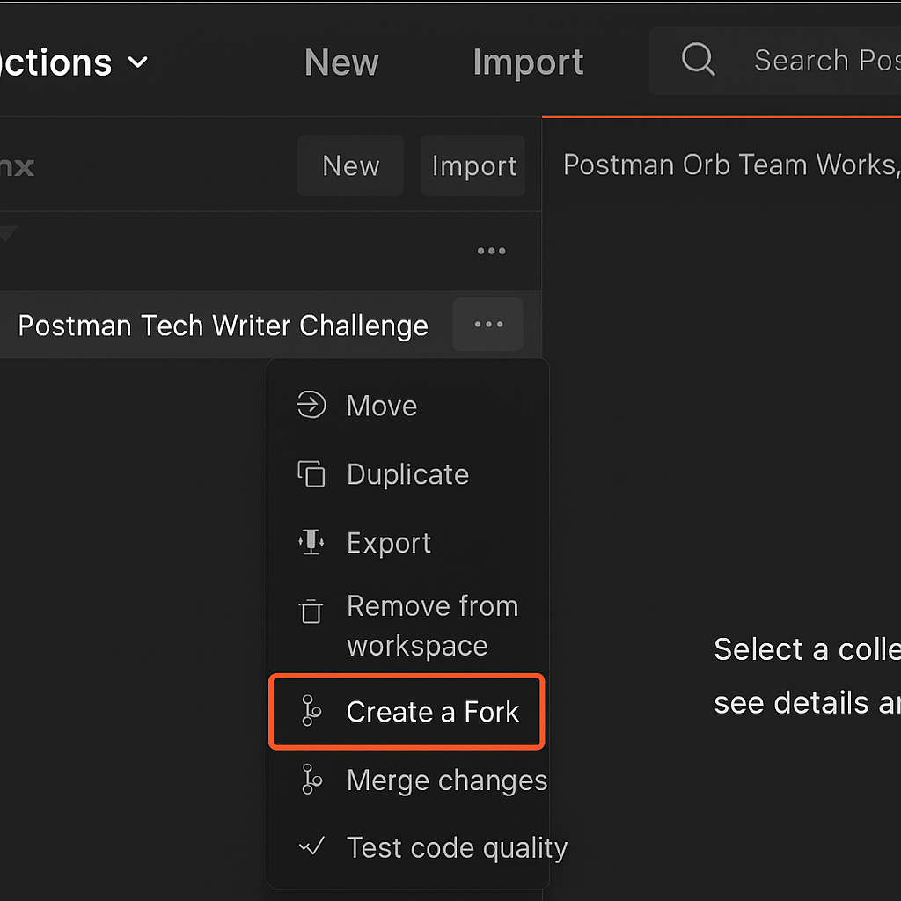

# Day 2: Version Control

_Organize, experiment, and manage your API requests like a pro—with Postman’s version control tools._

---

## 🧭 Overview

Today you'll learn how to use **version control** in Postman to safely experiment with changes, manage request history, and merge updates across collections. This mirrors how developers use Git—but in a visual, beginner-friendly way.

Version control is essential for tech writers working with evolving APIs. It helps you track changes, test new requests, and collaborate without breaking anything.

---

## 🎯 What You'll Learn

- How to fork a Postman collection
- How to create a feature branch for testing changes
- How to send a POST request with a JSON body
- How to use environments to manage dynamic URLs
- How to merge changes back into your main collection

---

## 🛠️ Step-by-Step Guide

### 1. Fork Your Collection

- Go to your `Postman Tech Writer Challenge` collection
- Click the **three-dot menu (⋮)** next to the collection name
- Select **“Create a Fork”**
- Name it: `feature-branch`
- Choose your workspace and click **Fork**



Now you have two versions of the same collection: your original and your feature branch.

---

### 2. Add a New Request to the Feature Branch

- In the `feature-branch` collection, create a new request inside a folder called `Version Control`
- Name the request: `New Request`
- Set the method to `POST`
- Set the URL to:

```
{{baseURL}}/post
```

---

### 3. Add a JSON Body

- Go to the **Body** tab
- Select **raw** and choose **JSON** from the dropdown
- Paste this JSON:

```
{
  "data": "noodles"
}
```

Postman will automatically add the `Content-Type: application/json` header.


---

### 4. Create and Use an Environment

- Click the **gear icon** in the top right corner of Postman
- Select **Manage Environments**
- Click **Add**
- Name: `myEnvironment`
- Add a variable:
  - Key: `baseURL`
  - Initial Value: `https://postman-echo.com`
- Save and set it as your active environment


Now Postman will replace `{{baseURL}}` with the correct URL when sending requests.

---

### 5. Send the Request

- Click **Send**
- You should receive a `200 OK` response with your JSON echoed back

---

### 6. Merge Your Changes

- Go back to your original collection
- Click the **three-dot menu (⋮)** next to it
- Select **“Merge Changes”**
- Choose the `feature-branch` as the source
- Review the changes and click **Merge**


---

## 🧠 What Just Happened?

You forked your collection to safely test changes, added a new POST request with a JSON body, used an environment variable to keep your URL flexible, and merged your updates back into the main collection.

This mirrors how developers use Git branches to test and merge code—but you did it visually, without writing a single line of code.

---

## ✍️ Tech Writer’s Lens

Version control is critical in API documentation. You’ll often need to test changes without affecting production requests. Forking and merging collections lets you experiment safely and track your work—especially when collaborating with developers.

---

## 📚 Glossary

- **Fork**: A copy of a collection you can edit independently
- **Merge**: Combining changes from one collection into another
- **Environment**: A set of variables that make your requests dynamic
- **POST request**: Sends data to an API (like submitting a form)

---

## 🔗 Resources

- [Version Control for Collections – Postman Docs](https://learning.postman.com/docs/collaborating-in-postman/version-control/version-control-overview/)
- [Postman Environments Overview](https://learning.postman.com/docs/sending-requests/variables/#using-environments)

---

## ✅ Next Step

Head to [03-environment-variables](../03-environment-variables/) to explore how environments can supercharge your API workflow.
